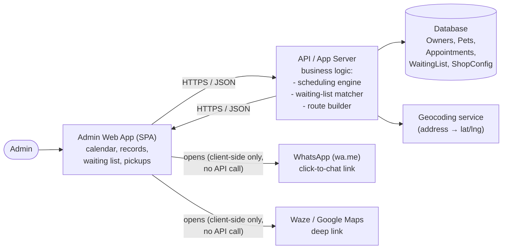
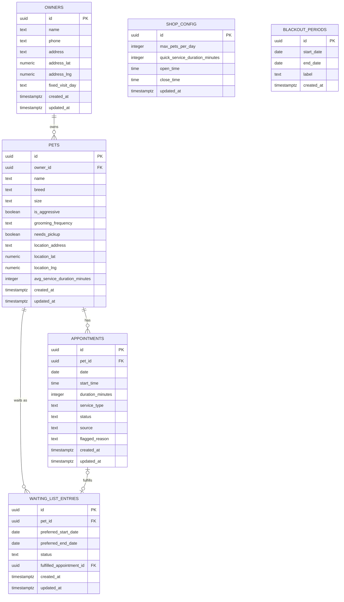

# System Design — Pet Grooming Shop Agenda System

## 1. Overview
This document describes the technical design for the system defined in
`requeriments.md`: an Admin-only agenda application for a pet grooming shop
(owner/pet records, multi-view calendar, auto-scheduling, waiting list,
pickup routing, and manual WhatsApp reminders).

## 2. Architecture

### 2.1 Architectural Style
A **monolithic web application**: one Admin-facing single-page app (SPA)
talking to one backend API, backed by one relational database. There is a
single actor (Admin) and moderate data volume (one shop, capped pets/day),
so a monolith is deliberately chosen over microservices — it avoids
unnecessary operational complexity (multiple deployments, service-to-service
auth, network failure modes) for a problem that doesn't need it.

### 2.2 High-Level Components

### 2.3 Layers
- **Presentation** — Admin SPA. Renders the calendar (day/week/month/year),
  records, waiting list, and pickups screens; handles drag-and-drop.
- **API** — REST/JSON endpoints for all CRUD operations and actions
  (approve recommendation, generate route, etc.). Stateless; the SPA is the
  only client.
- **Domain / business logic** (server-side, not in the SPA, so rules are
  enforced consistently regardless of client):
  - Scheduling engine — auto-generates appointments from grooming frequency
    (FR-8/FR-9), enforces capacity and blackout constraints (FR-10/FR-11).
  - Waiting-list matcher — size-based slot recommendations (FR-13).
  - Route builder — proximity ordering of pickup stops (FR-15), independent
    of shop location.
- **Persistence** — relational database (see Section 3 for entities).
  Chosen over a document store because the data is inherently relational
  (owner 1—N pets, pet 1—N appointments) and the calendar/date-range queries
  benefit from SQL.
- **Scheduled job** — a single recurring job (e.g., nightly) that runs the
  auto-scheduling engine. Not a full job queue/message broker — the volume
  (one shop, a handful of pets/day) doesn't warrant one.

### 2.4 Integration Points
- **WhatsApp** — no backend dependency. Per FR-17a, the system never sends
  messages itself; the SPA builds a `wa.me` click-to-chat link with the
  pre-filled message and opens it. No API key, no messaging provider.
- **Waze / Google Maps** — no backend dependency either. Both apps are
  supported (per FR-16); the SPA builds a URL scheme / deep link for
  whichever one the Admin picks at the moment of opening the route
  ("Open in Waze" / "Open in Google Maps" — see `User_Histories.md`
  HU-6.3), from the same ordered stop list.
- **Geocoding** — the one real external dependency. Pet/owner addresses need
  to be converted to coordinates so the route builder can order pickup stops
  by proximity (FR-15). This is a backend call (so results can be cached
  against the pet record instead of re-geocoding on every route request).

### 2.5 Authentication
Single Admin actor, no client-facing accounts (per `requeriments.md`
Section 2). A simple username/password login with a server-side session (or
short-lived token) is sufficient — no roles/permissions system is needed
since there is exactly one actor type with access. The Admin uses the app
from **one device at a time** (see Section 2.6 — Device Support), so there
is no need to support concurrent multi-device sessions for the same login.

### 2.6 Device Support
The Admin uses **one device at a time**, but that device can be a computer,
tablet, or phone interchangeably (e.g., desktop at the shop counter, tablet
or phone while out on pickups). This means the frontend must be responsive
across desktop, tablet, and mobile breakpoints — including the calendar
views and drag-and-drop interaction, which needs a touch-friendly fallback
(e.g., tap-to-move or a long-press drag) for phone/tablet use.

### 2.7 Technology Stack
- **Frontend**: Next.js (React) + Tailwind CSS.
- **Backend**: NestJS, as a separate service from the frontend. The
  Section 2.2 diagram's "SPA ↔ API / App Server" split matches this
  directly — Next.js is the SPA, NestJS is the API/App Server that hosts
  the scheduling engine, waiting-list matcher, and route builder.
- **Database**: Supabase (managed PostgreSQL). NestJS connects to it as the
  relational store described in Section 3. Supabase also offers Auth,
  Storage, and Realtime — worth revisiting Section 2.5 (Authentication)
  later to decide whether to use Supabase Auth or NestJS's own auth.
- **ORM**: Prisma, used by the NestJS backend for schema migrations and all
  queries against Supabase/PostgreSQL. The tables in Section 3 map directly
  to Prisma models.
- **Hosting**: Vercel for the Next.js frontend, Render for the NestJS
  backend.
- **Geocoding**: OpenStreetMap Nominatim, used server-side (NestJS) to
  convert pet/owner addresses into coordinates for the route builder
  (FR-15). Once the ordered route is built, opening it is a separate,
  client-side step where the Admin picks Waze or Google Maps (Section 2.4).

### 2.8 Repository Structure
Two separate repositories:
- **Frontend repo** — Next.js + Tailwind CSS app, deployed to Vercel.
- **Backend repo** — NestJS app, deployed to Render.

This is separate from the current `Fashion_Pets_PZ` repo, which holds
project docs (`docs/`) and the throwaway static prototype (`prototype/`).

## 3. Database Design
PostgreSQL (via Supabase). All tables use `uuid` primary keys
(`gen_random_uuid()`) and `timestamptz` audit columns (`created_at`,
`updated_at`) unless noted otherwise.

### 3.1 Entity-Relationship Diagram

`SHOP_CONFIG` and `BLACKOUT_PERIODS` have no foreign keys — they're
shop-wide configuration read by the scheduling engine, not linked to a
specific owner/pet/appointment.

### 3.2 Tables

**owners** — FR-1, FR-4
| Column | Type | Notes |
|---|---|---|
| id | uuid PK | |
| name | text, not null | |
| phone | text, not null | Not unique — HU-1.1 allows a shared household phone across two owners after admin confirmation. Duplicate-name+phone detection (HU-1.1) is an app-layer check, not a DB constraint. |
| address | text, nullable | Home address; default location source for the owner's pets (FR-2). |
| address_lat, address_lng | numeric, nullable | Geocoded (Nominatim) cache of `address`. |
| fixed_visit_day | text, nullable | One of `monday`…`sunday` (FR-4). |
| created_at, updated_at | timestamptz | |

**pets** — FR-2, FR-2a, FR-2b, FR-3
| Column | Type | Notes |
|---|---|---|
| id | uuid PK | |
| owner_id | uuid FK → owners.id, not null, `ON DELETE RESTRICT` | A pet always belongs to one owner (FR-3); block deleting an owner with pets rather than cascading, so appointment history isn't silently lost. |
| name | text, not null | |
| breed | text, nullable | |
| size | text, not null | `small` \| `medium` \| `extra_large` (FR-2b). |
| is_aggressive | boolean, not null, default false | |
| grooming_frequency | text, nullable | `twice_a_month` \| `once_a_month` \| `once_every_two_months` (FR-2a). Nullable = not yet configured. |
| needs_pickup | boolean, not null, default false | FR-2, drives Epic 6. |
| location_address | text, nullable | If null, the app falls back to the owner's `address` (FR-2). |
| location_lat, location_lng | numeric, nullable | Geocoded cache; null if ungeocoded/invalid (HU-6.1/6.2 "location missing" scenarios key off this). |
| avg_service_duration_minutes | integer, nullable | Nullable = not yet configured. |
| created_at, updated_at | timestamptz | |

A pet is **"incomplete for scheduling"** (HU-1.3, HU-3.1) whenever
`grooming_frequency` or `avg_service_duration_minutes` is null — this is a
derived/computed condition, not a stored flag.

**appointments** — FR-5–FR-9, FR-13a
| Column | Type | Notes |
|---|---|---|
| id | uuid PK | |
| pet_id | uuid FK → pets.id, not null, `ON DELETE RESTRICT` | |
| date | date, not null | Indexed — every calendar view and capacity check filters by this. |
| start_time | time, not null | |
| duration_minutes | integer, not null | Copied from `pets.avg_service_duration_minutes` (full groom) or `shop_config.quick_service_duration_minutes` (quick service) at creation time, so later changes to those defaults don't retroactively alter past/confirmed appointments. |
| service_type | text, not null | `full_groom` \| `quick_service` (FR-13a). |
| status | text, not null, default `scheduled` | `scheduled` \| `completed` \| `cancelled`. (Waiting/unscheduled pets live in `waiting_list_entries`, not here — see 3.4.) |
| source | text, not null | `manual` \| `auto_scheduled` \| `waiting_list_approval` — which flow created it (HU-3.1, HU-5.3). |
| flagged_reason | text, nullable | Free-text exception note, e.g. "delayed past due date — blackout period", "size-mismatch override approved" (HU-3.1, HU-5.3 validation scenarios). |
| created_at, updated_at | timestamptz | |

Overlap prevention (two appointments for the same pet at overlapping times,
HU-2.3) and daily-capacity enforcement (FR-11) are **application-layer**
checks run before insert/update, not DB constraints — both need
business-rule context (shop-wide max/day, service duration) that doesn't
belong in a `CHECK` clause.

**waiting_list_entries** — FR-12, FR-13, FR-13b
| Column | Type | Notes |
|---|---|---|
| id | uuid PK | |
| pet_id | uuid FK → pets.id, not null, `ON DELETE CASCADE` | |
| preferred_start_date, preferred_end_date | date, nullable | Open-ended if null (HU-5.1). |
| status | text, not null, default `active` | `active` \| `fulfilled` \| `cancelled`. |
| fulfilled_appointment_id | uuid FK → appointments.id, nullable | Set when an Admin approves a recommendation or manually books this entry (HU-5.3), alongside `status = 'fulfilled'`. |
| created_at, updated_at | timestamptz | `created_at` is also the tie-breaker for "longest waiting" ranking in the recommendation engine (HU-5.2). |

Matching a vacated slot to candidates (FR-13) is computed on demand by
querying `active` entries joined to `pets.size`, not a stored relationship
— there's nothing to persist until the Admin approves one (HU-5.3).

**shop_config** — FR-10, FR-11, FR-11a, FR-13a
Single-row table (app enforces exactly one row).
| Column | Type | Notes |
|---|---|---|
| id | uuid PK | |
| max_pets_per_day | integer, not null | FR-11. `CHECK (max_pets_per_day > 0)`. |
| quick_service_duration_minutes | integer, nullable | FR-13a. Nullable = quick service not yet configured (HU-5.4 validation scenario blocks booking one until set). |
| open_time, close_time | time, not null | FR-11a. Business hours; `CHECK (close_time > open_time)`. Appointment creation/move (manual, auto-scheduled, or drag-and-drop, HU-2.3) is validated against this range at the application layer, same as capacity and blackout periods. |
| updated_at | timestamptz | |

**blackout_periods** — FR-10
| Column | Type | Notes |
|---|---|---|
| id | uuid PK | |
| start_date, end_date | date, not null | `CHECK (end_date >= start_date)`. |
| label | text, nullable | e.g. "Summer vacation". |
| created_at | timestamptz | |

### 3.3 Not Persisted (Computed On Demand)
- **Pickup routes** (FR-14–FR-16) — not stored. A route is recomputed each
  time from `appointments` (today, `needs_pickup = true` pets) joined to
  `pets.location_lat/lng`, ordered by proximity, and the Waze/Google Maps
  links are built client-side from that response. Persisting a route would
  introduce staleness to manage (HU-6.3's "route data is stale" scenario)
  for data that's cheap to regenerate and only used once.
- **"Incomplete for scheduling"** pet flag — derived from
  `grooming_frequency`/`avg_service_duration_minutes` being null (see 3.2).
- **Daily booking count** (for FR-11 capacity checks) — `COUNT(*)` over
  `appointments` filtered by `date` and `status != 'cancelled'`.

### 3.4 Authentication Data
No custom `admins` table. Supabase Auth manages the single Admin account;
NestJS validates the Supabase-issued JWT on each request (Section 2.5/2.7).

### 3.5 Indexes
- `pets(owner_id)`
- `appointments(pet_id)`
- `appointments(date)` — calendar views (FR-5) and capacity checks (FR-11) both filter by date range.
- `waiting_list_entries(pet_id)`, `waiting_list_entries(status)`
- `blackout_periods(start_date, end_date)` — range-overlap lookups (FR-10)

### 3.6 Data Protection
Per NFR-5, `owners.address`/`address_lat/lng` and `pets.location_address`/
`location_lat/lng` are personal data. Access is already limited by
Section 2.5 (single authenticated Admin, no client-facing accounts); if
Supabase Row Level Security is enabled, policies should restrict all tables
to the authenticated Admin role.
